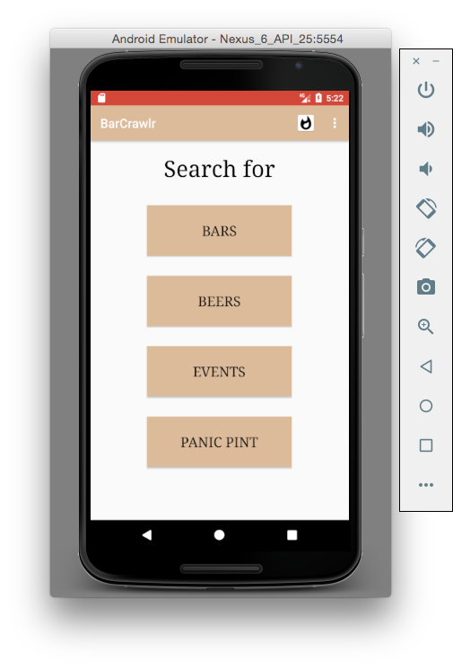
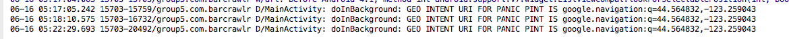
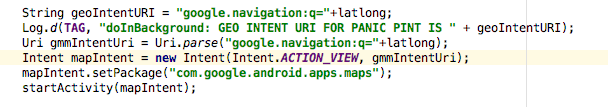
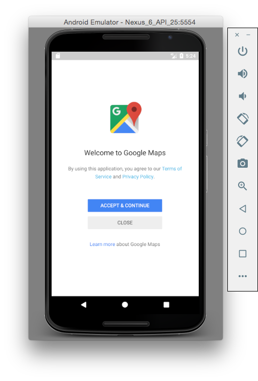

# BarCrawlr

BarCrawlr is an Android app for discovering and tracking local beers, bars, and events! Written by George Crary, Aidan O'Malley and Rhea Mae Edwards. This app served as our final project for CS 496 taught by [Rob Hess](http://web.engr.oregonstate.edu/~hessro/). Inspiration for this app came from my personal interest in microbrews and local bars in Corvallis.

The backend data serving this app comes from the BreweryDB API which is a crowd sourced service.

You can even find the closest place to grab a pint if you just got out of a midterm! Just hit the "PANIC PINT" button.

## The Panic Pint Button
### The GeoIntent URI

### Panic Pint Intent Creation

### Google Maps Navigation intent openning 

